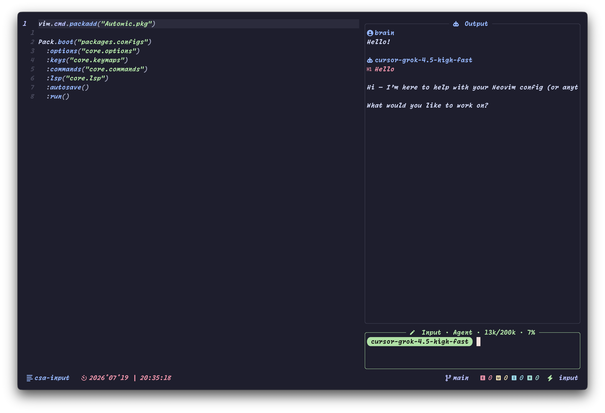

<div align="center">
  <h1>CSA.nvim</h1>
  <p>Cursor Side Agent for Neovim</p>
  <p>
    <a href="https://neovim.io"></a>
    <a href="LICENSE"></a>
  </p>
  <p><a href="README.md">English</a> · <strong>简体中文</strong></p>
</div>

---

## 范围

| 层 | 职责 |
| -- | ---- |
| Cursor CLI（`cursor-agent` / `agent`） | 模型、工具、流式输出、工作区改动 |
| CSA.nvim | 侧栏 UI、会话历史、文件白名单、改动审阅、快捷键 |

权威说明见 `:help csa`（`doc/csa.txt`）。

生命周期：

```text
open → prompt → stream → review → restore
```

<p align="center">
  
</p>

## 目录

- [环境](#环境)
- [安装](#安装)
- [命令](#命令)
- [面板](#面板)
- [快捷键](#快捷键)
- [模式与模型](#模式与模型)
- [文件与审阅](#文件与审阅)
- [历史与恢复](#历史与恢复)
- [重新生成 / 编辑](#重新生成--编辑)
- [配置](#配置)
- [数据目录](#数据目录)
- [Lua API](#lua-api)
- [许可证](#许可证)

---

## 环境

- Neovim 0.10+
- [Cursor CLI](https://cursor.com/docs/cli) 在 `$PATH` 中（优先 `cursor-agent`，否则回退 `agent`）
- 面板内文件选择器需要 [`fd`](https://github.com/sharkdp/fd)
- 可选：[render-markdown.nvim](https://github.com/MeanderingProgrammer/render-markdown.nvim)（美化 Output）

认证：`CURSOR_API_KEY` 或 `cursor-agent login`。

---

## 安装

仓库：[https://github.com/Brandon-kk/CSA.nvim](https://github.com/Brandon-kk/CSA.nvim)

### Automic / Pack

```lua
Pack.register({
  "https://github.com/Brandon-kk/CSA.nvim",
  module = "csa",
}):load({
  cmd = { "CSAToggle", "CSAsk", "CSAgents" },
  config = function(plugin)
    plugin.setup({
      ui = { width = 0.40 },
      provider = {
        command = "cursor-agent",
        force = true,
        auth = { env = "CURSOR_API_KEY" },
      },
    })
  end,
})
```

### lazy.nvim

```lua
{
  "Brandon-kk/CSA.nvim",
  cmd = { "CSAToggle", "CSAsk", "CSAgents" },
  opts = {
    ui = { width = 0.40 },
    provider = {
      command = "cursor-agent",
      force = true,
      auth = { env = "CURSOR_API_KEY" },
    },
  },
}
```

---

## 命令

| 命令 | 行为 |
| ---- | ---- |
| `:CSAToggle` | 打开/关闭侧栏。默认 `agent` 模式（可用 `[` / `]` 切换）。 |
| `:CSAsk` | 打开并锁定 `ask` 模式。visual / `:[range]` 预填 Input。`:CSAsk {文本}` 打开后**立即发送**。 |
| `:CSAgents` | 打开并锁定 `agent` 模式。visual / `:[range]` 预填 Input。 |

---

## 面板

右侧 pad 分栏 + 浮层：

| 面板 | 职责 |
| ---- | ---- |
| Output | 对话记录（Markdown；可选 render-markdown）。可聚焦以导航 / 重生成 / 编辑。 |
| Files | 附加路径；Agent 改动后显示仅前景色的统计（`󰐕n 󰍴n`）。 |
| Input | 输入；标题含模式与上下文用量（如 `12k/200k · 6%`）。 |

外部全屏浮层（如 LazyGit）会暂时隐藏 CSA。

---

## 快捷键

### 全局（面板内）

| 按键 | 行为 |
| ---- | ---- |
| `Tab` / `S-Tab` | 在 Output → Files → Input 间循环。进入 Output 时落在**用户消息**上。 |
| `<C-w>{chord}` | 离开 CSA，回到主编辑区（常用分屏键已重绑）。 |
| `<C-c>` | 流式输出进行中时取消请求。 |

流式输出期间多数面板快捷键锁定；`<C-c>` 始终可用。

### Input

| 按键 | 行为 |
| ---- | ---- |
| `<CR>` | 发送 |
| `<S-CR>`（插入） | 换行 |
| `f` | 文件选择器（`fd`） |
| `h` | 历史会话 |
| `A` | 选择模型 |
| `[` / `]` | 切换模式：plan ↔ agent ↔ ask（锁定时无效） |
| `R` | 重新生成最后一轮 |
| `<C-u>` / `<C-d>` | 滚动 Output（不离开 Input） |

### Output

| 按键 | 行为 |
| ---- | ---- |
| `[` / `]` | 上一条 / 下一条**用户**消息（循环） |
| `y` | 复制消息正文（`"` 与 `+`） |
| `r` | 重新生成当前用户回合 |
| `e` | 编辑当前用户消息后重发 |
| `Esc` | 回到 Input |

### Files

| 按键 | 行为 |
| ---- | ---- |
| `d` | 移除光标下附加文件 |
| `e` | 在主编辑区打开文件 |
| `Esc` | 回到 Input |

### 被改文件的 buffer（Agent 审阅）

| 按键 | 行为 |
| ---- | ---- |
| `ca` | 接受当前 buffer 改动（无匹配时接受全部） |
| `cr` | 拒绝并恢复（无匹配时拒绝全部） |
| `gaa` | 接受**全部**待审阅改动（全局） |
| `gra` | 拒绝**全部**待审阅改动（全局） |

### 文件选择器 / 历史 / 模型

| 按键 | 行为 |
| ---- | ---- |
| `Esc` / `q` | 取消 |
| `<CR>` | 文件：切换多选 · 历史：打开 · 模型：选中 |
| `<C-CR>` | 文件：确认附加 |
| `R` | 模型：从 CLI 刷新列表 |
| `d` | 历史：删除会话 |

---

## 模式与模型

| 模式 | CLI 行为 |
| ---- | -------- |
| `plan` | `--mode plan`（只读规划） |
| `agent` | 默认可写路径（省略 `--mode`；配置开启时带 `--force`） |
| `ask` | `--mode ask` |

所选模型会缓存并以 `--model` 传入（`auto` 时省略）。

---

## 文件与审阅

用 `f` 附加路径。白名单非空时，白名单外的 Agent 写入会被拒绝并回滚。

| 步骤 | 行为 |
| ---- | ---- |
| 快照 | 工具写入前保存内容 |
| 装饰 | gutter sign + 删除行虚线（无 Diff 背景） |
| Files 面板 | 仅前景色增删统计 |
| 接受 / 拒绝 | 被改 buffer 上 `ca` / `cr`；全局 `gaa` / `gra` 全部接受 / 拒绝 |

改动会记在 assistant 历史消息上，供重新生成 / 编辑重发时回退。

---

## 历史与恢复

会话保存在[数据目录](#数据目录)。打开历史（`h`）时在 Output 预览；Enter 继续该会话。取消则恢复原先 Output 与会话 id。

重开 `:CSAToggle` 会恢复上次有内容的会话（`cache/last_session.json`）。强制新会话：

```lua
require("csa").open({ fresh = true })
```

---

## 重新生成 / 编辑

目标回合 = Output 光标（或 `[` / `]` 选中）所在的**用户**消息；Input 的 `R` 使用最后一轮。

| 操作 | 行为 |
| ---- | ---- |
| `r` 重新生成 | 保留该用户消息；删除之后全部消息；回退文件改动；清除 Cursor `--resume` id 并重问（注入本地历史）。 |
| `e` 编辑后重发 | 将用户文本载入 Input；删除该用户消息及之后全部；回退改动；下次 `<CR>` 带历史种子发送。 |

---

## 配置

```lua
require("csa").setup({
  language = "en",
  ui = {
    width = 0.30,
    border = "rounded",
    input = { height = 3, icon = "󰏫" },
    files = { enabled = false, max_visible = 5, icon = "󰈙" },
    output = { icon = "󰚩" },
  },
  identity = {
    name = nil,
    icon = "",
  },
  provider = {
    enabled = true,
    command = "cursor-agent",
    workspace = nil,
    auth = { env = "CURSOR_API_KEY", key = nil },
    force = false,
    stream = true,
    trust = true,
  },
})
```

| 字段 | 类型 | 说明 |
| ---- | ---- | ---- |
| `language` | `string` | 注入 provider prompt 的回复语言。默认 `en`。未知值回退 `en`。 |
| `ui.width` | `number` | `(0,1]` 为列宽比例；`>1` 为绝对列数。 |
| `ui.border` | `string` / `table` | 浮层边框样式。 |
| `ui.input.height` | `integer` | Input 浮层高度（行）。 |
| `ui.input.icon` | `string` | Input 标题图标。 |
| `ui.files.enabled` | `boolean` | 无附加文件时也显示 Files。 |
| `ui.files.max_visible` | `integer` | Files 最大可见行数。 |
| `ui.files.icon` | `string` | Files 标题图标。 |
| `ui.output.icon` | `string` | Output / 助手图标。 |
| `identity.name` | `string` / `nil` | Output 用户标题名；默认 `git user.name` / `$USER`。 |
| `identity.icon` | `string` | 用户标题图标。 |
| `provider.enabled` | `boolean` | 关闭后仅 UI、不调 CLI。 |
| `provider.command` | `string` | CLI 可执行文件；可回退 `cursor-agent` / `agent`。 |
| `provider.workspace` | `string` / `nil` | 工作目录；`nil` → `getcwd()`。 |
| `provider.auth.env` | `string` | 存放密钥的**环境变量名**（不是密钥本身）。 |
| `provider.auth.key` | `string` / `nil` | 可选内联密钥（更推荐 env）。 |
| `provider.force` | `boolean` | agent 模式传 `--force`（写盘时常需）。 |
| `provider.stream` | `boolean` | `stream-json` + 部分增量。 |
| `provider.trust` | `boolean` | 无头运行传 `--trust`。 |

`language` 支持（18）：`en` · `zh-CN` · `zh-TW` · `ja` · `ko` · `fr` · `de` · `es` · `pt` · `ru` · `it` · `nl` · `pl` · `tr` · `ar` · `hi` · `vi` · `th`。

---

## 数据目录

根目录：`stdpath("data")/site/csa/`

| 路径 | 内容 |
| ---- | ---- |
| `history/<id>.json` | 会话消息、`cursor_chat_id`、各轮 edits |
| `cache/models.json` | 模型列表缓存 |
| `cache/selected_model.json` | 当前模型 |
| `cache/last_session.json` | 上次会话 id（重开恢复） |
| `agents/*.md` | 人格 / 上下文文档（非空时注入 prompt） |

---

## Lua API

| 调用 | 行为 |
| ---- | ---- |
| `csa.setup({opts})` | 应用配置并初始化高亮。 |
| `csa.config()` | 返回解析后的选项表。 |
| `csa.toggle()` | 切换面板（agent 模式，未锁定）。 |
| `csa.open({opts})` | 打开面板。`opts.mode`：`"ask"` \| `"agent"` \| `"plan"`；`opts.mode_locked`；`opts.fresh` 跳过上次会话恢复。 |
| `csa.close()` | 关闭面板（有内容时写入上次会话）。 |
| `csa.ask([{prefill}], [{opts}])` | 打开锁定 ask 模式；可选预填 Input。`opts.submit` 为立即发送。 |
| `csa.agents([{prefill}])` | 打开锁定 agent 模式；可选预填 Input。 |
| `csa.set_files_visible([{visible}])` | 显示 / 隐藏 Files（`nil` 切换）。 |
| `csa.get_files()` | 返回已附加绝对路径。 |

底层模块（进阶）：`csa.ui.picker`、`csa.storage`、`csa.review`、`csa.ai.cursor`。

---

## 许可证

[MIT License](LICENSE)
